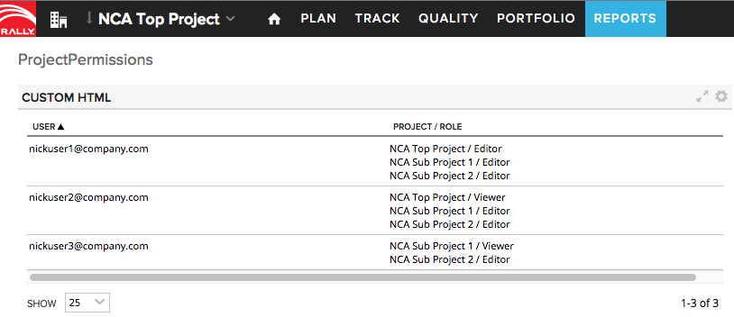

Users Project Permissions
=========================

## Overview

WARNING!
ProjectPermissions query grabs all ProjectPermissions to which a user has access, in a Workspace.
If you run as a Workspace Admin, it will grab all ProjectPermissions in the Workspace. If run as a Sub Admin, it will grab all ProjectPermissions in the sub.
Unlike most WSAPI endpoints, ProjectPermissions endpoint doesn't acccept any query filter.
It can be a dangerous query to run because of this.For workspaces with thousands of users and hundreds of projects, hitting this endpoint can end up creating a DB query that's accessing hundreds of thousands of rows.

The screenshot above captures a run of this app by a workspace administrator of a small workspace with three users.

This app is not part of Rally App Catalog and is not supported by Rally. It is available AS IS.

## License

AppTemplate is released under the MIT license.  See the file [LICENSE](./LICENSE) for the full text.

##Documentation for SDK

You can find the documentation on our help [site.](https://help.rallydev.com/apps/2.0/doc/)
